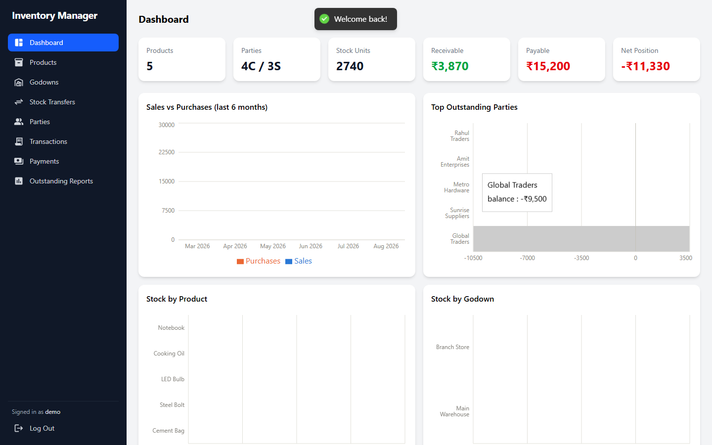
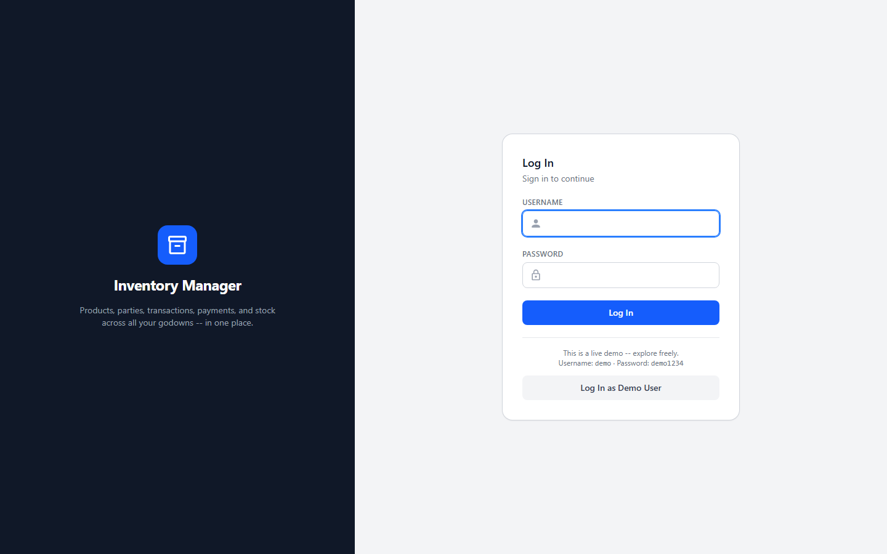
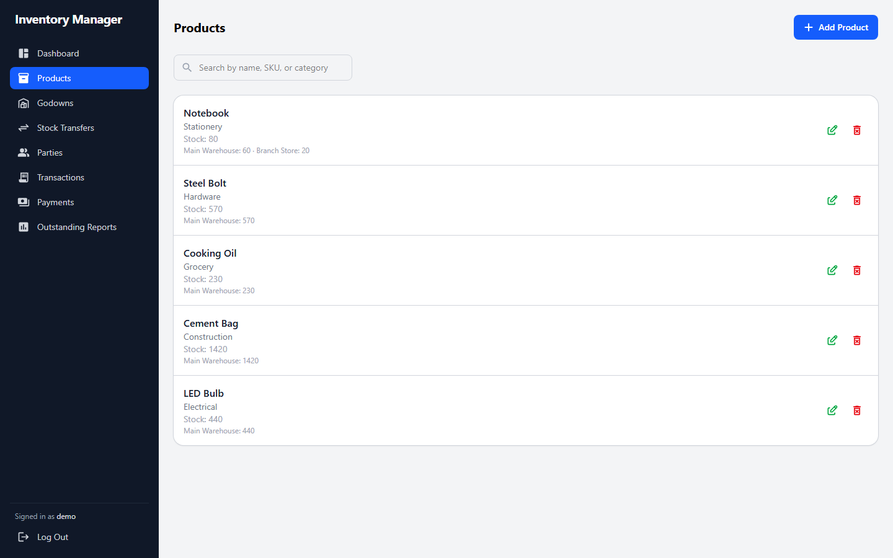
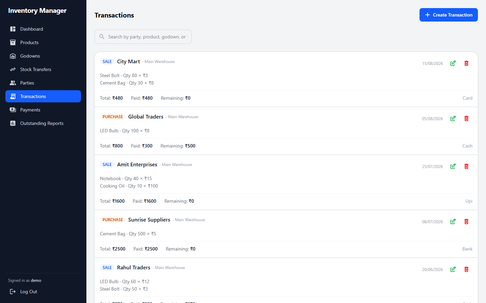

# Inventory Manager

A full-stack inventory and accounts management system — products, multi-warehouse stock, stock transfers, customer/supplier transactions, payments, party ledgers, outstanding reports, and dashboard analytics, all behind role-based access control.

**🔗 Live demo:** [inventory-manager-ywfq.vercel.app](https://inventory-manager-ywfq.vercel.app)
Click **"Log In as Demo User"** on the login page, or use `demo` / `demo1234` — full read/write access, data resets automatically every 6 hours.



<details>
<summary>More screenshots</summary>

| Login | Products | Transactions |
|---|---|---|
|  |  |  |

</details>

## Features

- **Products** — catalog with SKU, category, unit, and live stock levels broken down per warehouse
- **Godowns (warehouses)** — multiple stock locations with per-location stock views
- **Stock transfers** — move inventory between warehouses with full audit trail
- **Parties** — customers/suppliers (a party can be both) with contact info and opening balances
- **Transactions** — sales and purchases with multi-line items, partial payments, and automatic stock validation (a sale can't oversell what's actually in that warehouse)
- **Payments** — record money received/paid against a party, independent of any single transaction
- **Party ledgers** — running balance per party across every transaction and payment, chronologically
- **Outstanding reports** — who owes what, and what's owed to whom, at a glance
- **Dashboard** — sales vs. purchases trend, top outstanding parties, stock breakdowns by product and warehouse
- **Role-based access** — `super_admin` manages user accounts; `admin` has full operational access to everything else
- **Search + pagination** on every list view, debounced and server-side

## Tech Stack

**Frontend** — React 19 (Vite), Redux Toolkit + RTK Query, React Router (lazy-loaded routes), Tailwind CSS, Recharts

**Backend** — Node.js, Express, MongoDB + Mongoose, JWT auth (httpOnly cookies), bcrypt

**Hardening** — Helmet, rate limiting on login, server-side input validation on every write, pagination caps, soft deletes

**Testing** — Vitest + Supertest + mongodb-memory-server — 57 tests against a real in-memory MongoDB instance, not mocks

**Deployment** — client and API deployed as separate Vercel projects (static site + serverless functions), proxied under one origin; GitHub Actions for CI (tests + lint + build on every push) and a scheduled demo-data reset

## Architecture

```
client/   React app (Vite) — deployed as a static Vercel project
server/   Express API — deployed as Vercel serverless functions
          (server/api/index.js is the serverless entry point;
           server/server.js is the traditional entry point for
           local dev / any persistent-process host)
```

In production, the client's `vercel.json` proxies `/api/*` to the backend project, so the browser only ever talks to one origin — no CORS, no cross-site cookie handling needed. Locally, the two run as separate dev servers with the client pointed at the local API via `client/.env`.

## Getting Started

### Prerequisites

- Node.js 20+
- A MongoDB connection string (a free [MongoDB Atlas](https://www.mongodb.com/cloud/atlas) cluster works fine)

### Setup

```bash
git clone https://github.com/aftabbhatkar09/inventory-manager.git
cd inventory-manager

npm install          # root: installs `concurrently` for the dev script
cd server && npm install && cd ..
cd client && npm install && cd ..
```

Create `server/.env`:

```bash
MONGO_URI=<your MongoDB connection string>
JWT_SECRET=<any long random string>
PORT=5000
CLIENT_ORIGIN=http://localhost:5173

# Auto-creates the first account (super_admin) on a fresh database
ADMIN_USERNAME=admin
ADMIN_PASSWORD=<pick a password>

# Optional: also seeds a second, regular admin account
STAFF_ADMIN_USERNAME=staff
STAFF_ADMIN_PASSWORD=<pick a password>
```

Create `client/.env`:

```bash
VITE_API_URL=http://localhost:5000/api
```

### Run it

```bash
npm run dev          # from the repo root -- runs client + server together
```

- Client: [http://localhost:5173](http://localhost:5173)
- API: [http://localhost:5000](http://localhost:5000)

Optionally, seed some realistic sample data (products, parties, a few months of transactions):

```bash
cd server && npm run seed
```

### Tests

```bash
cd server && npm test
```

### Lint & build the client

```bash
cd client && npm run lint && npm run build
```

## CI/CD

Every push runs the server's test suite and builds the client (`.github/workflows/ci.yml`). A separate scheduled workflow (`.github/workflows/reset-demo.yml`) resets the live demo's data every 6 hours via a secret-protected API endpoint, so the public demo stays presentable without manual upkeep.
